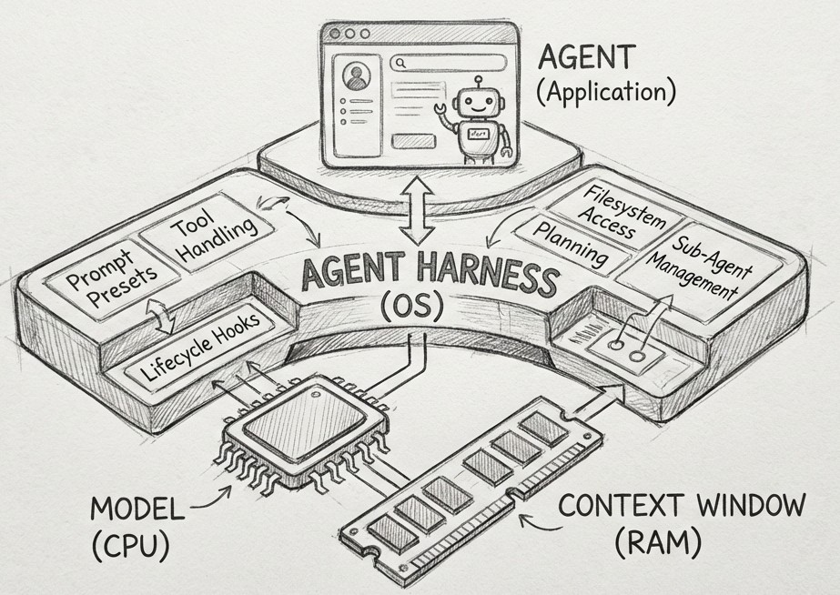

<style>
:root {
  --slidev-theme-primary: #2E2D62;
  --slidev-theme-secondary: #1E5DF8;
  --slidev-theme-accent: #00A788;
}

.slidev-layout.cover  {
  background-color: #2E2D62;
  color: #FFFFFF;
}

h1 {
  color: #00A788; /* Using your Accent color for the Title */
}


</style>


# State of AI

A tour of AI agents for scientific research

<div class="flex justify-center gap-8 mt-4">
  <figure class="text-center">
    
  </figure>
</div>


---
layout: center
---

<Toc minDepth="1" maxDepth="1" />

---

# What is an Agent?

- Simple answer: "an LLM that can do things"
- Better answer: an LLM in a "harness." The LLM generates commands, the harness executes them
- Its tools are just programs:
    - Bash Commands
    - Text editors
    - Web search (Google, etc.)
    - *Anything you can do on a computer*

<v-click>

```bash
> "List the files in my folder"
[llm-with-bash]$ ls .
MyFolder/ file.txt
```

</v-click>


---
hideInToc: true
---

# Prompt-Chaining (ReACT Loop)

- Why stop after a single tool call?
- Prompt-chaining: feed tool outputs back into the agent as new prompts
- The agent alternates between **reasoning** and **acting**

<v-click>

```bash {lines:true}
> "Write a Python script that models exponential growth"
(agent-reasoning) "I need a correct definition and formula for exponential growth."
(agent-tool:search) "exponential growth definition"
[tool-output] [Results include Wikipedia, BBC Bitesize, etc.]
(agent-reasoning) "I’ll use Wikipedia as a reference."
(agent-tool:http) GET en.wikipedia.org/wiki/Exponential_growth
[tool-output] <article content>
(agent-reasoning) "I now have the formula. I can write the script."
(agent-tool:write) Create exponential_growth.py
[tool-output] File written.
(agent-response) "I’ve created exponential_growth.py. Want me to run or plot it?"
```

</v-click>

<v-click> TL;DR: an agent is an LLM with tools in a loop </v-click>


---
layout: two-cols-header
hideInToc: true
---

# The 21st Century Computer

::left::

- LLMs have limited "context windows" and cannot recall previous context windows

<v-click>

- However, tool use means an agent can now:
    - Write ideas/plans/learnings to files
    - Read those files later
- This means the agent can:
    - Load "programs" (any file it can read)
    - Execute "programs" (ReACT loop)
    - Save the results (write to a file)

</v-click>

<v-click>
<span style="color: #955438">

## An agent is *a computer for the computer*

</span>

</v-click>

::right::

<v-click at="1">



</v-click>

---

# What can agents do?
Many things

An AI agent with access to your code repo can:

<v-clicks>

- Understand the entire codebase
- Write extensive documentation (which it can then use in future)
- Autonomously design and implement new features
- Conduct literature reviews and identify new developments relevant to your research
- Profile code performance and identify optimisations
- Improve code quality, check for bugs, fix security vulnerabilities
- Run end-to-end scientific simulations and reason about the outputs

</v-clicks>


---
hideInToc: true
---

# What have I done with agents?

In the past 4 months I have:
- Built a fully featured data archival system for cryo-EM datasets (and then ported the entire thing to rust in an afternoon)
- Built a recursive-language-model system based on A. Zhang's paper [(Link)](https://arxiv.org/abs/2512.24601)
- Built a kubernetes-based web app for running securely sandboxed agents in the cloud in ~2 days
- Built a few multi-agent "orchestration" systems (GUI, CLI etc)
- Identified several optimisations for a GPU-based electron integrator I built last year
- Developed a 4D game with ECS and physics
- Built various extensions and plugins for software I use daily
- Built a fully autonomous openclaw clone from scratch that plays text adventures and continuously "learns" over months

- and more, all for fun!


---
hideInToc: true
---

# Agents are not magic
Sorry

Agents *can* do all these things, but they're not magically good at it.

- The output from the agent is only as good as what goes into it.
- Problems aren't solved through one-shot prompting
- You need to teach the agent about the problem
- *Treat agents as a colleague you need to teach*

| Expectation | Result |
|-------------|--------|
| "The agent can build my entire simulator from scratch" | The agent made utter garbage, AI sucks! |
| "


---

# How to use agents
Just talk to it

- Before doing any work with an agent, ask it to explore your project
- Talk to it about what you want.
    - Small task? It can just do it
    - Big task? Build a plan with it. Ask it to critique the plan, *have a dialogue.*
- When you're happy, let it run and then **review the output**
- If the amount to review is huge, set up a reviewer agent to help!
- Make some kind of artifact (git history, reports, kanban boards, whatever).
- Build structure around your work

### Don't overthink it. Just talk to it.


---

# Can an agent help me with my research?
What if the problem is too niche?

## Yes, it can help

Even if the data for your research is not in the training set, it can help.

1) The agent probably knows more than you realise (e.g. AI knows a good amount about DFT).
2) If the exact thing you need isn't in its training data, *it can find and learn the relevant information.*
3) The agent can build itself a "memory" with documents to "remember" about your work.

If the agent doesn't know something, you can teach it and it can help.

---

# Agentic Design Patterns

- Memory systems:
    - Agents have no long-term memory. But we can make them with filesystems and databases.

- Tools:
    - How can an agent use software outside of bash? MCP? CLI? API? GUI? ACRONYM-PI?

- Parallelism:
    - How do we run multiple agents at once? *Should we run multiple at once?*

- Security:
    - How do we control what tools the agent has?


---
hideInToc: true
---

# Long Term Memory

- Agents don't remember anything from prior context windows.
- But they can write stuff down and read it again! This is called RAG
    - Agentic RAG = give the agent grep
    - Advanced RAG: vector databases, BM25 search etc.

- [qmd](https://github.com/tobi/qmd) is an excellent tool

## General Principles

1) Progressive disclosure: don't stuff everything into one file
2) Forgetting: prune and consolidate information that is no longer relevant


---
hideInToc: true
---

# Software for agents

- Keep things simple. The best thing you can do is make a CLI and document it.
- 


---
hideInToc: true
---

# Parallel Agents and Team-Working


---
hideInToc: true
---

# Security


---

# Get started


---

# My principles of agentic programming

<v-clicks>

1) The agent is a computer, and I augment my thinking with computers
    - *I should write "programs" to structure the agent's work. "Agile development is a computer program"*

2) If I do not think about what I'm doing, I will become a slop cannon
    - *I should create well-structured plans and understand my code.*

3) Project state should live in source code, not in my memory
    - *Agents should be able to understand a project based on .*

4) I can only focus on 1-2 things at a time
    - 

5) Bash is all you need

</v-clicks>


---
layout: statement
hideInToc: true
---

# Don't be a slop cannon


{.max-h-100 .object-contain .mx-auto}
